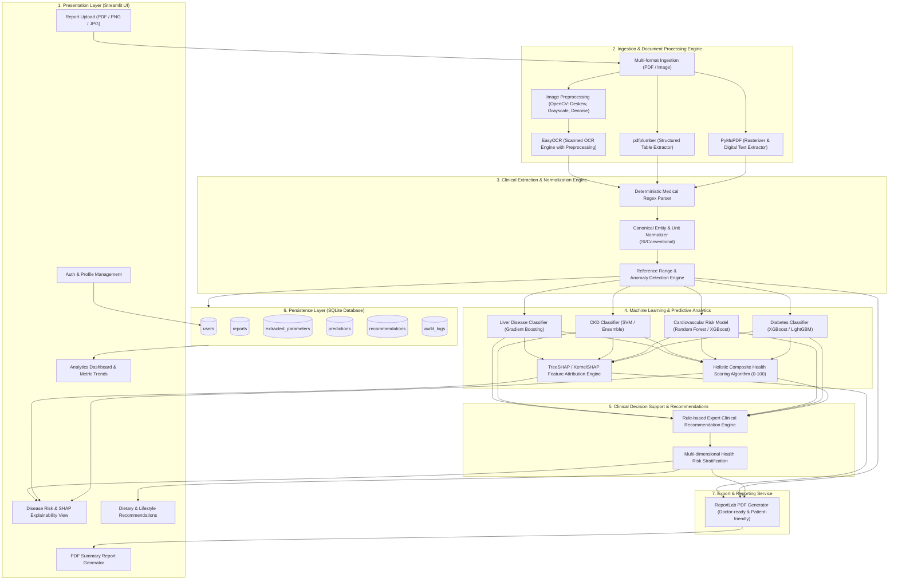
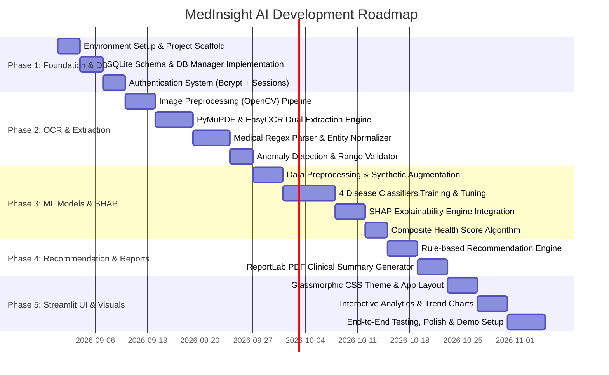

# MedInsight AI: System Architecture & Project Blueprint

**Project Title:** MedInsight AI: Intelligent Medical Report Analysis, Disease Risk Prediction & Personalized Health Recommendation System  
**Role Scope:** Senior Python Architect, ML Engineer, OCR Specialist, Healthcare Data Analyst, and Streamlit Expert.

---

## 1. System Architecture



---

## 2. Complete Folder & File Structure

```text
MedicalReportAnalyzer/
├── .streamlit/
│   └── config.toml                  # Streamlit theme (custom primary colors, fonts, margins)
├── assets/
│   ├── css/
│   │   └── style.css                # Premium modern glassmorphism & responsive CSS
│   ├── images/
│   │   ├── logo.png                 # Application logo
│   │   └── default_avatar.png       # User profile default icon
│   └── sample_reports/              # Sample test medical reports (CBC, LFT, KFT, Lipid Profile)
│       ├── sample_cbc_scan.png
│       ├── sample_lipid_digital.pdf
│       └── sample_metabolic_scan.pdf
├── data/
│   ├── raw/                         # Raw public ML datasets (UCI, Kaggle)
│   │   ├── diabetes.csv
│   │   ├── heart_statlog.csv
│   │   ├── ckd.csv
│   │   └── indian_liver_patient.csv
│   ├── processed/                   # Processed feature arrays & benchmark sets
│   └── reference_ranges.json        # Standard clinical reference limits & canonical mappings
├── database/
│   ├── __init__.py
│   ├── connection.py                # SQLite thread-safe connection manager
│   ├── schema.sql                   # Database DDL initialization script
│   └── db_manager.py                # CRUD service operations for users, reports, predictions
├── models/
│   ├── saved_models/                # Serialized pipelines & models (.joblib / .json)
│   │   ├── diabetes_xgb.joblib
│   │   ├── heart_rf.joblib
│   │   ├── kidney_xgb.joblib
│   │   ├── liver_xgb.joblib
│   │   └── scalers_encoders.joblib
│   ├── train_diabetes.py            # Training & cross-validation pipeline for Diabetes
│   ├── train_heart.py               # Training & cross-validation pipeline for Heart Disease
│   ├── train_kidney.py              # Training & cross-validation pipeline for CKD
│   ├── train_liver.py               # Training & cross-validation pipeline for Liver Disease
│   └── evaluate.py                  # Evaluation scripts (AUC-ROC, F1, Precision-Recall)
├── src/
│   ├── __init__.py
│   ├── auth/
│   │   ├── __init__.py
│   │   ├── authenticator.py         # Passlib/bcrypt password hashing & session management
│   │   └── validators.py            # Email & password policy validators
│   ├── ocr/
│   │   ├── __init__.py
│   │   ├── preprocessor.py          # OpenCV deskew, contrast stretching (CLAHE), binarization
│   │   └── text_extractor.py        # PDF text parser (PyMuPDF & pdfplumber)
│   │   └── ocr_engine.py            # EasyOCR wrapper with bounding-box heuristic extraction
│   ├── parser/
│   │   ├── __init__.py
│   │   ├── regex_patterns.py        # Parameter regexes, synonyms & aliases
│   │   ├── normalizer.py            # Unit conversion (e.g., mg/dL to mmol/L)
│   │   └── anomaly_detector.py      # Reference range comparison & flag categorization (Low/Normal/High/Critical)
│   ├── ml/
│   │   ├── __init__.py
│   │   ├── predictor.py             # Inference pipeline with missing value imputation fallback
│   │   ├── shap_explainer.py        # SHAP waterfall, summary & force plot generators
│   │   └── health_score.py          # Weighted composite Health Score engine (0-100)
│   ├── recommender/
│   │   ├── __init__.py
│   │   ├── rule_engine.py           # Dietary, lifestyle, physical activity & consultation rules
│   │   └── knowledge_base.py        # Medical evidence-based recommendation templates
│   └── reporting/
│       ├── __init__.py
│       └── pdf_generator.py         # ReportLab engine producing clinical summary PDF reports
├── views/
│   ├── __init__.py
│   ├── login_page.py                # Login & Registration views
│   ├── upload_page.py               # Upload report, extraction verification & parameter editor
│   ├── disease_risk_page.py         # ML disease risk predictions & SHAP interactive plots
│   ├── health_score_page.py         # Comprehensive health metric breakdown & radar charts
│   ├── recommendations_page.py      # Personalized action plan (Diet, Exercise, Precautions)
│   ├── analytics_page.py            # Historical trends (HbA1c, Cholesterol, Creatinine over time)
│   └── profile_page.py              # User demographics, medical history & settings
├── tests/
│   ├── test_ocr.py                  # OCR extraction unit tests
│   ├── test_parser.py               # Regex parsing & unit normalization tests
│   ├── test_models.py               # ML model inference & edge-case input tests
│   └── test_db.py                   # SQLite CRUD operations tests
├── app.py                           # Main Streamlit execution entrypoint & navigation
├── requirements.txt                 # Project dependencies with pinned versions
├── README.md                        # Documentation & setup instructions
└── run.bat / run.sh                 # Quick launch script
```

---

## 3. SQLite Database Schema (`schema.sql`)

```sql
-- 1. Users Table
CREATE TABLE IF NOT EXISTS users (
    id INTEGER PRIMARY KEY AUTOINCREMENT,
    username VARCHAR(50) UNIQUE NOT NULL,
    email VARCHAR(100) UNIQUE NOT NULL,
    password_hash VARCHAR(255) NOT NULL,
    full_name VARCHAR(100) NOT NULL,
    age INTEGER,
    gender VARCHAR(10) CHECK(gender IN ('Male', 'Female', 'Other')),
    blood_group VARCHAR(5),
    height_cm REAL,
    weight_kg REAL,
    created_at DATETIME DEFAULT CURRENT_TIMESTAMP,
    updated_at DATETIME DEFAULT CURRENT_TIMESTAMP
);

-- 2. Medical Reports Table
CREATE TABLE IF NOT EXISTS reports (
    id INTEGER PRIMARY KEY AUTOINCREMENT,
    user_id INTEGER NOT NULL,
    report_title VARCHAR(150),
    report_type VARCHAR(50) DEFAULT 'General Blood Test', -- CBC, LFT, KFT, Lipid Profile, Comprehensive
    file_name VARCHAR(255) NOT NULL,
    file_path VARCHAR(500) NOT NULL,
    file_size_kb REAL,
    raw_extracted_text TEXT,
    report_date DATE,
    upload_timestamp DATETIME DEFAULT CURRENT_TIMESTAMP,
    ocr_confidence REAL,
    status VARCHAR(20) DEFAULT 'Processed', -- Pending, Processed, Failed
    FOREIGN KEY (user_id) REFERENCES users(id) ON DELETE CASCADE
);

-- 3. Extracted Clinical Parameters Table
CREATE TABLE IF NOT EXISTS extracted_parameters (
    id INTEGER PRIMARY KEY AUTOINCREMENT,
    report_id INTEGER NOT NULL,
    parameter_name VARCHAR(100) NOT NULL,    -- e.g., Fasting Blood Glucose, HbA1c, Serum Creatinine
    canonical_name VARCHAR(100) NOT NULL,    -- Standardized key, e.g., 'glucose_fasting'
    category VARCHAR(50),                   -- Hematology, Renal, Hepatic, Lipid, Metabolic
    measured_value REAL NOT NULL,
    unit VARCHAR(30) NOT NULL,               -- mg/dL, g/dL, %, U/L, etc.
    reference_low REAL,
    reference_high REAL,
    flag VARCHAR(20) NOT NULL,               -- 'LOW', 'NORMAL', 'HIGH', 'CRITICAL'
    confidence_score REAL DEFAULT 1.0,
    created_at DATETIME DEFAULT CURRENT_TIMESTAMP,
    FOREIGN KEY (report_id) REFERENCES reports(id) ON DELETE CASCADE
);

-- 4. Disease Predictions Table
CREATE TABLE IF NOT EXISTS predictions (
    id INTEGER PRIMARY KEY AUTOINCREMENT,
    report_id INTEGER NOT NULL,
    disease_type VARCHAR(50) NOT NULL,       -- 'Diabetes', 'Heart Disease', 'Kidney Disease', 'Liver Disease'
    risk_probability REAL NOT NULL,          -- e.g., 0.84
    risk_level VARCHAR(20) NOT NULL,         -- 'Low', 'Moderate', 'High', 'Critical'
    model_name VARCHAR(50) NOT NULL,
    model_version VARCHAR(20) NOT NULL,
    shap_summary_json TEXT,                  -- JSON serialized top contributing features & SHAP values
    created_at DATETIME DEFAULT CURRENT_TIMESTAMP,
    FOREIGN KEY (report_id) REFERENCES reports(id) ON DELETE CASCADE
);

-- 5. Composite Health Scores Table
CREATE TABLE IF NOT EXISTS health_scores (
    id INTEGER PRIMARY KEY AUTOINCREMENT,
    report_id INTEGER UNIQUE NOT NULL,
    overall_score REAL NOT NULL,             -- 0 - 100
    metabolic_score REAL NOT NULL,
    cardiac_score REAL NOT NULL,
    renal_score REAL NOT NULL,
    hepatic_score REAL NOT NULL,
    score_grade VARCHAR(10) NOT NULL,        -- 'Excellent', 'Good', 'Fair', 'Poor', 'Critical'
    calculated_at DATETIME DEFAULT CURRENT_TIMESTAMP,
    FOREIGN KEY (report_id) REFERENCES reports(id) ON DELETE CASCADE
);

-- 6. Personalized Recommendations Table
CREATE TABLE IF NOT EXISTS recommendations (
    id INTEGER PRIMARY KEY AUTOINCREMENT,
    report_id INTEGER NOT NULL,
    category VARCHAR(50) NOT NULL,           -- 'Diet', 'Exercise', 'Lifestyle', 'Medical Consultation'
    priority VARCHAR(20) NOT NULL,           -- 'High', 'Medium', 'Low'
    title VARCHAR(200) NOT NULL,
    description TEXT NOT NULL,
    target_risk VARCHAR(50),                 -- 'Diabetes', 'Lipid Management', etc.
    created_at DATETIME DEFAULT CURRENT_TIMESTAMP,
    FOREIGN KEY (report_id) REFERENCES reports(id) ON DELETE CASCADE
);

-- 7. Audit & Activity Logs Table
CREATE TABLE IF NOT EXISTS audit_logs (
    id INTEGER PRIMARY KEY AUTOINCREMENT,
    user_id INTEGER,
    action VARCHAR(100) NOT NULL,
    details TEXT,
    ip_address VARCHAR(45),
    timestamp DATETIME DEFAULT CURRENT_TIMESTAMP,
    FOREIGN KEY (user_id) REFERENCES users(id) ON DELETE SET NULL
);

-- Indices for Fast Querying
CREATE INDEX IF NOT EXISTS idx_users_username ON users(username);
CREATE INDEX IF NOT EXISTS idx_reports_user_id ON reports(user_id);
CREATE INDEX IF NOT EXISTS idx_params_report_id ON extracted_parameters(report_id);
CREATE INDEX IF NOT EXISTS idx_params_canonical ON extracted_parameters(canonical_name);
CREATE INDEX IF NOT EXISTS idx_predictions_report_id ON predictions(report_id);
CREATE INDEX IF NOT EXISTS idx_health_scores_report_id ON health_scores(report_id);
```

---

## 4. Development Roadmap



### Roadmap Breakdown:
1. **Phase 1: Environment, Database & Security**
   - Project dependencies setup (`requirements.txt`).
   - SQLite DDL setup with relational constraints and indexing.
   - Robust Authentication module with hashed passwords, session cookies, and registration validators.
2. **Phase 2: Multimodal OCR & Clinical Parameter Parser**
   - OpenCV preprocessing pipeline (grayscale, Gaussian thresholding, deskewing).
   - Hybrid OCR engine (PyMuPDF for digital PDFs, EasyOCR for scanned PDFs/images, pdfplumber for tabular data).
   - Canonical entity dictionary mapping aliases (e.g., "FBS", "Fasting Glucose", "B-Glucose" $\to$ `glucose_fasting`).
   - Automated reference range checking flagging `LOW`, `NORMAL`, `HIGH`, `CRITICAL`.
3. **Phase 3: Machine Learning, SHAP Explainability & Health Scoring**
   - Train 4 production ML models (Diabetes, Heart Disease, Chronic Kidney Disease, Liver Disease) using Scikit-Learn and XGBoost with hyperparameter optimization.
   - Integrated TreeSHAP to compute individual parameter contribution scores and generate visual force/waterfall explanation charts.
   - Clinical composite Health Score algorithm (0–100) weighting multi-organ biomarkers.
4. **Phase 4: Expert Recommendation & PDF Generation Engine**
   - Evidence-based clinical recommendation engine categorized by Diet, Lifestyle, Exercise, and Specialist Referrals.
   - ReportLab PDF generator rendering doctor-ready, downloadable medical summaries with visual risk badges.
5. **Phase 5: Streamlit Web UI & Dashboard Analytics**
   - Modern glassmorphic theme with responsive multi-tab navigation.
   - Upload & live extraction preview where users can review and edit parsed parameters.
   - Interactive historical trend charts (Plotly) tracking patient vital metrics over time.
   - End-to-end unit and integration testing.
